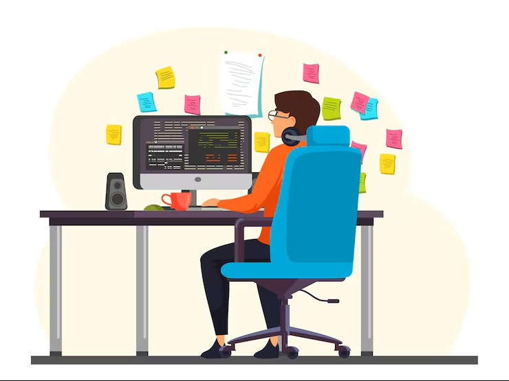

<!-- ========================================================= -->
<!--                     HERO SECTION                          -->
<!-- ========================================================= -->

<div align="center">



<br><br>

# Hi 👋 I'm **Raja Das**

### CS Student • Software Developer • Problem Solver


<br><br>

<a href="https://github.com/RAJA0212DAS">

</a>

<a href="https://www.linkedin.com/in/raja-das-6b3a45305">

</a>

<a href="https://leetcode.com/u/RAJA0212DAS/">

</a>

<br><br>


</div>

---

# 👨‍💻 About Me

I'm a **Computer Science student** passionate about programming, software development, and learning modern technologies.

I enjoy turning ideas into practical projects while strengthening my problem-solving and development skills.

My current technology interests include **Python, C++, Java, HTML, CSS, AWS, and AI productivity tools such as Claude and ChatGPT**.

I strongly believe:

> **"The best way to learn technology is by building with it."**

---

# 🚀 Quick Overview

- 🎓 **CS Student**
- 💻 Working with **Python, C++ & Java**
- 🌐 Learning and building with **HTML & CSS**
- ☁️ Exploring **AWS**
- 🤖 Using **Claude & ChatGPT** as AI development tools
- 🚀 Building practical software projects
- 🤝 Open to learning, collaborations & opportunities
- 🧠 Focused on improving programming and problem-solving skills

---

# 👨‍💻 Developer Profile

<table>
<tr>

<td width="55%" valign="top">

## 💡 Who Am I?

```yaml
Name        : Raja Das
Role        : CS Student

Tech Stack:
  Languages:
    - Python
    - C++
    - Java

  Frontend:
    - HTML
    - CSS

  Cloud:
    - AWS

  AI Tools:
    - Claude
    - ChatGPT

Projects:
  - ATM System
  - Sikha Setu

Status:
  - Learning
  - Building
  - Improving

Open To:
  - Internships
  - Collaborations
  - Developer Opportunities
```

</td>

<td width="45%" align="center">


</td>

</tr>
</table>

---

# 🛠️ Tech Stack

<div align="center">

## 💻 Programming Languages


<br><br>

## 🌐 Frontend


<br><br>

## ☁️ Cloud


<br><br>

## 🤖 AI Tools


</div>

---

# 🧩 Areas of Interest

<div align="center">

| 💻 Programming | 🌐 Development | ☁️ Modern Tech |
|:---:|:---:|:---:|
| Python | HTML & CSS | AWS |
| C++ | Software Development | AI Tools |
| Java | Problem Solving | Cloud Computing |

</div>

---

# 💻 Coding Profiles

<div align="center">

<a href="https://github.com/RAJA0212DAS">

</a>

<a href="https://leetcode.com/u/RAJA0212DAS/">

</a>

</div>

<br>

> I enjoy learning programming by building projects, solving problems, and experimenting with new technologies.

---

# 🚀 Featured Projects

## 🏧 ATM System

<table>
<tr>

<td width="60%">

### 📌 Overview

A practical ATM-system project focused on implementing core banking-style operations through a simple software interface.

### ✨ Features

- Account-based operations
- Deposit
- Withdraw
- Balance checking
- Transaction-oriented logic
- Practical programming implementation

### 🛠 Tech Stack

- C++
- Java
- Core Programming Concepts

</td>

<td width="40%" align="center">

<a href="https://github.com/RAJA0212DAS/Atm-system">


</a>

</td>

</tr>
</table>

---

## 📚 Sikha Setu

<table>
<tr>

<td width="60%">

### 📌 Overview

A learning-focused project designed around building a practical educational software experience.

### 🛠 Tech Stack

- Python
- HTML
- CSS
- AWS

### 🎯 Focus

- Python development
- Web technologies
- Cloud exploration
- Practical project building

</td>

<td width="40%" align="center">

<a href="https://github.com/RAJA0212DAS/Sikha-setu">


</a>

</td>

</tr>
</table>

---

# 📂 More Projects Coming Soon...

I'm continuously learning and building new projects to improve my development skills.

### 🔜 Areas I'm Exploring

- 🐍 Python Projects
- ⚡ C++ Programming
- ☕ Java Development
- 🌐 Web Development
- ☁️ AWS & Cloud
- 🤖 AI-Assisted Development
- 🧩 Problem Solving

---

# ⭐ Project Philosophy

> **"Every project is an opportunity to learn something new."**

I focus on learning by building, experimenting with technologies, and improving my programming skills one project at a time.

---

# 📊 GitHub Analytics

<p align="center">
  
  
</p>

---

# 🔥 GitHub Streak

<p align="center">
  
</p>

---

# 📈 Contribution Activity

<p align="center">
  
</p>

---

# 💬 Favorite Quote

<div align="center">

> **"Success is built one commit at a time."**

</div>

---

# ⭐ Thanks for Visiting

<div align="center">

### Thank you for visiting my GitHub profile!

I'm always learning, building, and exploring new technologies.

Feel free to explore my repositories and connect with me.

### 🚀 Happy Coding!

</div>
