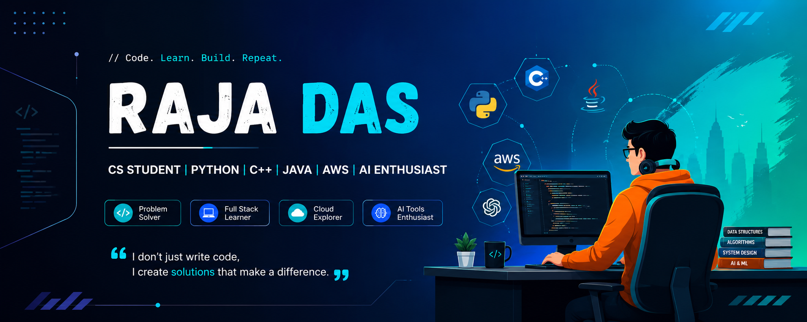

<!-- ========================================================= -->
<!--                     RAJA DAS PROFILE                       -->
<!-- ========================================================= -->

<div align="center">



<br><br>


<br><br>

<a href="https://github.com/RAJA0212DAS">

</a>

<a href="https://www.linkedin.com/in/raja-das-6b3a45305">

</a>

<a href="https://leetcode.com/u/RAJA0212DAS/">

</a>

<br><br>


</div>

---

# 👋 Hi, I'm Raja Das

### 💻 CS Student | Python | C++ | Java | AWS | AI Enthusiast

I'm a **Computer Science student** who enjoys learning through practical projects, programming challenges, and experimenting with modern technologies.

My current focus is on improving my programming fundamentals, building useful software projects, learning web technologies, exploring AWS, and using AI tools to make development more productive.

> **Code. Learn. Build. Repeat.**

---

# 👨‍💻 Developer Profile

<table>
<tr>

<td width="55%" valign="top">

## 💡 Who Am I?

```yaml
Name        : Raja Das
Role        : CS Student

Languages:
  - Python
  - C++
  - Java

Frontend:
  - HTML
  - CSS

Cloud:
  - AWS

AI Tools:
  - Claude
  - ChatGPT

Projects:
  - ATM System
  - Sikha Setu

Currently Focused On:
  - Programming
  - Software Development
  - Web Development
  - AWS
  - AI-assisted Development

Open To:
  - Internships
  - Collaborations
  - Developer Opportunities
```

</td>

<td width="45%" align="center">


</td>

</tr>
</table>

---

# 🚀 What I Do

<div align="center">

| 💻 Programming | 🌐 Development | ☁️ Cloud & AI |
|:---:|:---:|:---:|
| Python | HTML | AWS |
| C++ | CSS | Claude |
| Java | Software Projects | ChatGPT |
| Problem Solving | Web Development | AI-Assisted Coding |

</div>

---

# 🛠️ Tech Stack

<div align="center">

### 💻 Languages


<br><br>

### 🌐 Frontend


<br><br>

### ☁️ Cloud


<br><br>

### 🤖 AI Tools


</div>

---

# 📚 Currently Learning

<div align="center">

| Area | Focus |
|:---|:---:|
| 🐍 Python | ████████░░ |
| ⚡ C++ | ███████░░░ |
| ☕ Java | ███████░░░ |
| 🌐 HTML & CSS | ███████░░░ |
| ☁️ AWS | █████░░░░░ |
| 🤖 AI Tools | ███████░░░ |

</div>

---

# 🚀 Featured Projects

## 🏧 ATM System

<table>
<tr>

<td width="60%" valign="top">

### 📌 Overview

A practical ATM-system project focused on implementing common banking operations and core programming logic.

### ✨ Features

- Account operations
- Deposit
- Withdraw
- Balance checking
- Transaction-oriented logic
- Console-based interaction

### 🛠️ Technology

- C++
- Java
- Core Programming Concepts

</td>

<td width="40%" align="center">

<a href="https://github.com/RAJA0212DAS/Atm-system">


</a>

</td>

</tr>
</table>

---

## 📚 Sikha Setu

<table>
<tr>

<td width="60%" valign="top">

### 📌 Overview

A learning-focused software project built to explore practical development using Python, frontend technologies, and cloud concepts.

### 🛠️ Technology

- Python
- HTML
- CSS
- AWS

### 🎯 Focus

- Python development
- Web technologies
- Cloud exploration
- Practical project building

</td>

<td width="40%" align="center">

<a href="https://github.com/RAJA0212DAS/Sikha-setu">


</a>

</td>

</tr>
</table>

---

# 🧩 Areas of Interest

<div align="center">

| 💻 Software | 🌐 Web | 🤖 AI & Cloud |
|:---:|:---:|:---:|
| Programming | HTML & CSS | AWS |
| Problem Solving | Web Development | AI Tools |
| Software Engineering | Practical Projects | Cloud Computing |

</div>

---

# 💻 Coding Profiles

<div align="center">

<a href="https://github.com/RAJA0212DAS">

</a>

<a href="https://leetcode.com/u/RAJA0212DAS/">

</a>

<a href="https://www.linkedin.com/in/raja-das-6b3a45305">

</a>

</div>

---

# 📊 GitHub Analytics

<div align="center">


</div>

---

# 🔥 GitHub Streak

<div align="center">


</div>

---

# 📈 Contribution Activity

<div align="center">


</div>

---

# 🎯 My Goal

> **Learn consistently. Build meaningful projects. Become a better developer every day.**

I'm working toward becoming a strong software developer by combining programming fundamentals, practical projects, web technologies, cloud knowledge, and AI-assisted development.

---

# 💬 Favorite Quote

<div align="center">

### **"I don't just write code, I create solutions."**

</div>

---

# ⭐ Thanks for Visiting

<div align="center">

### Thanks for visiting my GitHub profile! 👋

Feel free to explore my repositories, connect with me, and follow my journey as I learn, build, and grow.

### 🚀 Happy Coding!

</div>
